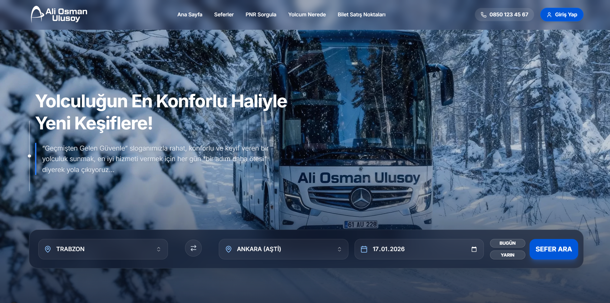
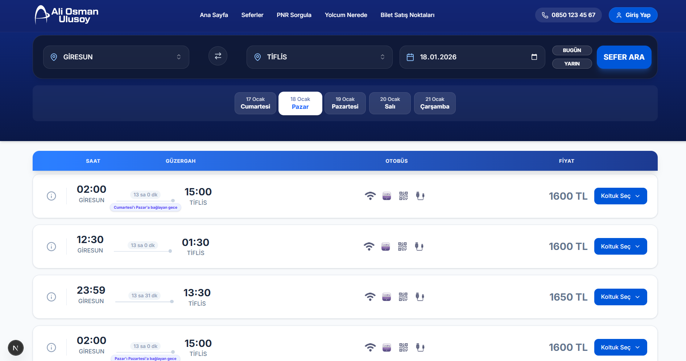
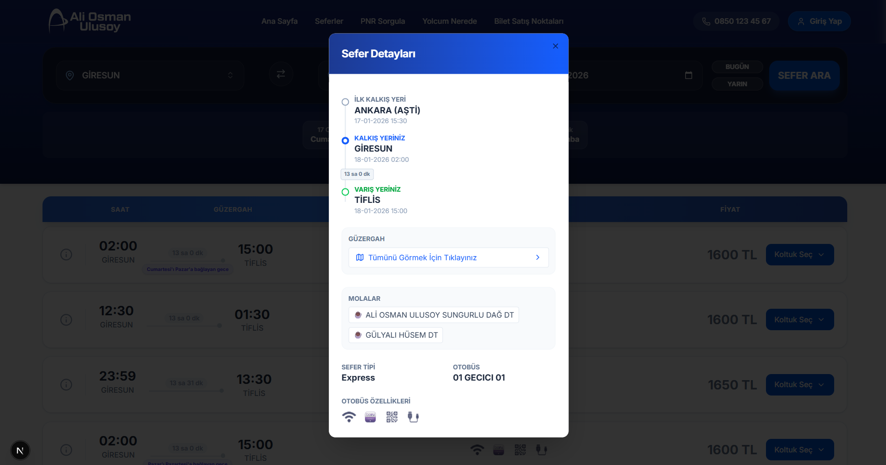
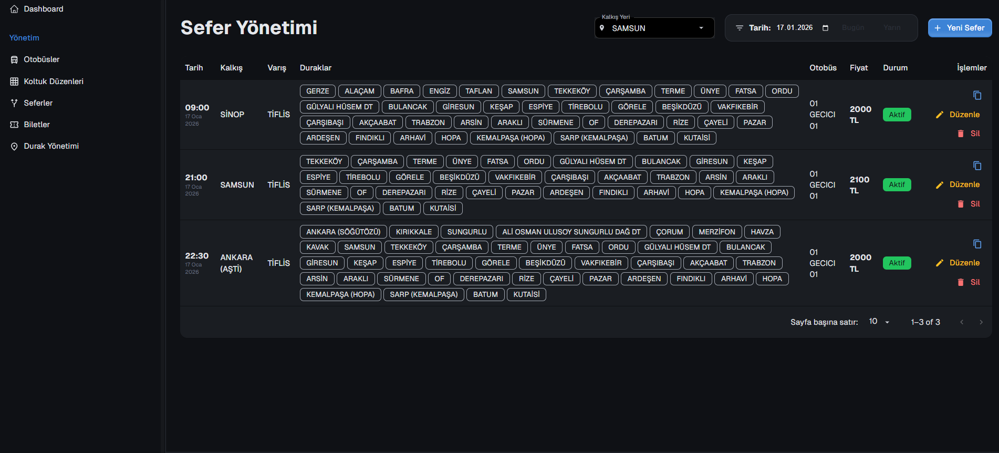
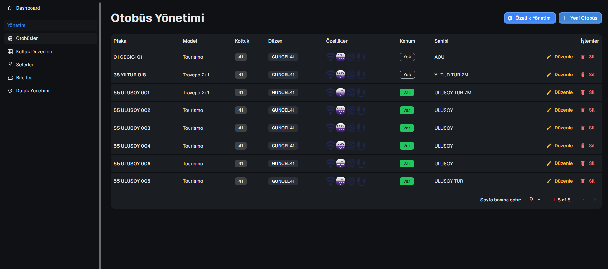
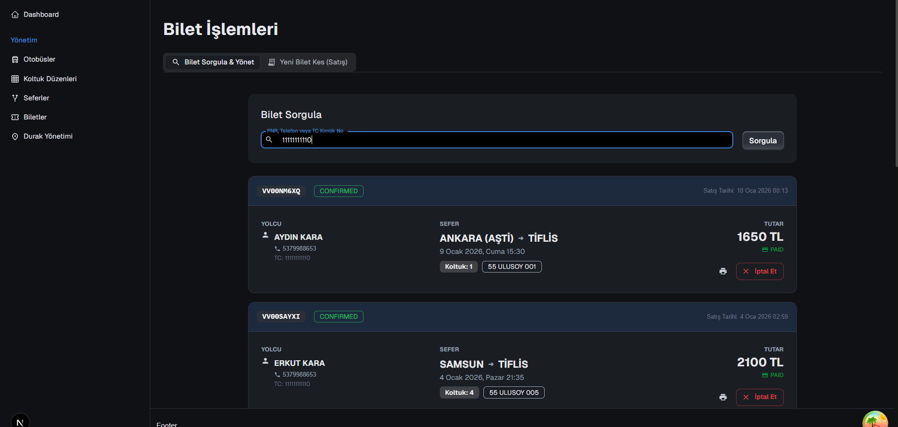

# 🚌 Ulusoy Turizm - Bus Ticketing & Fleet Management System

A comprehensive, **Full-Stack** web application designed to handle the digital operations of a modern bus company, including Ticket Sales, Route Management, Real-time Vehicle Tracking, and an advanced Admin Dashboard.

## 🚀 Project Overview

The system consists of 3 main modules:
1.  **Frontend (Client Panel):** A modern, responsive interface for customers to search for trips, select seats, and purchase tickets.
2.  **Admin Panel:** A powerful dashboard for company staff to manage routes, buses, pricing matrices, and agents.
3.  **Backend (API):** A robust RESTful API service built with NestJS and PostgreSQL to manage data flow and business logic.

 ## DEMO BİLGİLERİ
 Ana Sayfa Demo: https://aou.devosuit.com/ <br>
 Admin Panel Demo (Auth gereklidir): https://auadmin.devosuit.com/ <br>
 PNR Sorgulama için: PNR: [VV00LJBVP] Tel: [5305303030]

---

## 🛠️ Technology Stack

### Frontend & Admin Panel
*   **Framework:** Next.js 15 (App Router)
*   **Language:** TypeScript
*   **UI Libraries:** Tailwind CSS, Shadcn/UI, Material UI (Admin)
*   **State Management:** TanStack Query (React Query)
*   **Maps:** React Leaflet (integrated with OpenStreetMap & Google Maps Tiles)
*   **Icons:** Lucide React

### Backend
*   **Framework:** NestJS
*   **Database:** PostgreSQL
*   **ORM:** Prisma
*   **Validation:** Class-validator & Class-transformer
*   **Security:** JWT Authentication, BCrypt Hashing

---

## 🌟 Key Features

### 1. 🖥️ Client Panel (Frontend)
*   **Gidiş-Dönüş (Round Trip) Support:** Full implementation of two-way ticket booking with separate selection phases and unified payment.
*   **Interactive Seat Selection:** Visual bus layout with Gender-based seat reservation (Male/Female selection logic).
*   **Premium Dark Theme:** Modern slate-900 background across all account, info, and search pages for superior readability and aesthetics.
*   **Live Tracking (Where is my Bus?):** Real-time tracking of active buses on a map, showing current location and speed.
*   **User Account System:** 
    *   **Puan Sistemi:** Earn 10% of ticket price as points (TL) on every trip.
    *   **Profilim:** Comprehensive view of personal data and recent ticket history.
    *   **Bilet Yönetimi:** Easy cancellation and suspension (açığa alma) features for users.
*   **Dynamic Information Pages:** Automated "Resting Facilities" list synced with station data, plus branded FAQ and Passenger Rights.

<div align="center">
  
  
  
</div>

### 2. 🛡️ Admin Dashboard
*   **Operational Stats:** Real-time dashboard showing daily/monthly revenue, passenger counts, and upcoming trips.
*   **User Management:** Full CRUD operations for Users, Accounts, and Customers with search by TC No, Name, or Phone.
*   **Route Management:** Recurring trip creation and **Smart Pricing Engine** for automatic segment price calculation.
*   **Fleet Management:** Custom Seat Layout designer (2+1, 2+2) and dynamic bus feature management.

<div align="center">
  
  
  
</div>

### 3. ⚙️ Backend Logic
*   **Segment-Based Inventory:** Intelligent algorithm allowing a single seat to be sold multiple times on different segments.
*   **Loyalty Points Engine:** Backend logic for automatic point calculation and accumulation upon ticket confirmation.
*   **Security & Permissions:** Multi-level authorization (Admin, Agent, Customer) with strict ownership checks for ticket operations.

---

## 📦 Installation & Setup

To run this project locally, follow these steps:

### Prerequisites
*   Node.js (v18+)
*   PostgreSQL

### 1. Backend Setup
```bash
cd ulusoy-back
npm install
# Create a .env file and add your database connection
npx prisma db push
npm run start:dev
```

### 2. Admin Panel Setup
```bash
cd ulusoy-admin
npm install
npm run dev
```
**Default Credentials:** `admin@ulusoy.com` / `admin123`

### 3. Frontend Setup
```bash
cd ulusoy-front
npm install
npm run dev
```

---

## 👨‍💻 Developer Notes

This project was developed following **Software Engineering** best practices, focusing on modularity, scalability, and maintainability. It demonstrates a high-level integration of real-time data tracking, complex business rules (segment ticketing), and modern UI/UX design patterns. Verified for production build success across all modules.
